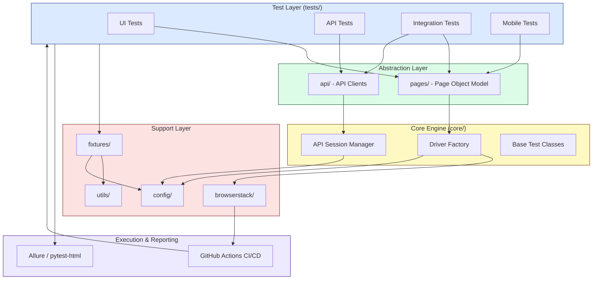
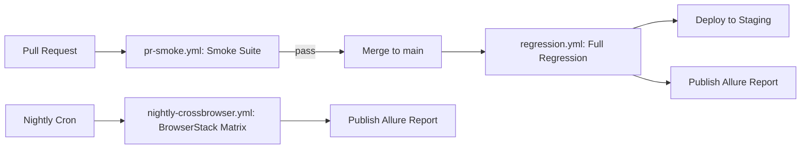

# Framework Design – Enterprise QA Automation Framework

**Document Type:** Architecture Design Document
**Author:** Principal Test Automation Architect
**Version:** 1.0
**Status:** Approved for Implementation

---

## 1. Framework Overview

This document defines the architecture of an enterprise-grade Test Automation Framework built to support scalable, maintainable, and multi-platform quality engineering across Web UI, REST API, cross-browser, and mobile/device surfaces.

The framework is built on **Python 3.11** with **Pytest** as the test runner, **Playwright** for browser automation, and **Requests** for API automation. It follows the **Page Object Model (POM)** for UI abstraction, uses **Pytest fixtures** for dependency injection and lifecycle management, integrates with **BrowserStack** for cross-browser/device execution, and is orchestrated end-to-end through **GitHub Actions** CI/CD. Reporting is handled through **pytest-html** for lightweight run summaries and **Allure Reports** for rich, historized, stakeholder-facing reporting.

The architecture is designed around four guiding pillars: **separation of concerns**, **reusability**, **environment agnosticism**, and **CI-native execution**. Every layer of the framework — configuration, page objects, API clients, fixtures, and utilities — is independently testable, independently replaceable, and composable into higher-level test scenarios without duplication.

This design is intended to serve as the reference blueprint for engineers onboarding onto the framework, and as the architectural contract that governs how new modules, tests, and integrations are added over time.

---

## 2. Folder Structure

```
qa-automation-framework/
│
├── api/                        # API client layer (endpoints, request builders, response models)
│   ├── clients/
│   │   ├── auth_client.py
│   │   ├── project_client.py
│   │   └── tenant_client.py
│   ├── models/
│   │   └── schemas.py
│   └── __init__.py
│
├── pages/                      # Page Object Model classes for UI automation
│   ├── base_page.py
│   ├── login_page.py
│   ├── dashboard_page.py
│   ├── project_page.py
│   └── components/
│       └── navbar_component.py
│
├── tests/                      # Test suites organized by test level/domain
│   ├── ui/
│   │   ├── test_login.py
│   │   └── test_project_management.py
│   ├── api/
│   │   ├── test_auth_api.py
│   │   └── test_project_api.py
│   ├── integration/
│   │   └── test_ui_api_sync.py
│   ├── mobile/
│   │   └── test_mobile_responsive.py
│   └── tenant_isolation/
│       └── test_tenant_boundaries.py
│
├── fixtures/                   # Reusable Pytest fixtures (scoped by domain)
│   ├── browser_fixtures.py
│   ├── api_fixtures.py
│   ├── data_fixtures.py
│   └── tenant_fixtures.py
│
├── browserstack/                # BrowserStack-specific integration logic
│   ├── capabilities.py
│   ├── bstack_connector.py
│   └── local_tunnel.py
│
├── config/                     # Environment and configuration management
│   ├── environments/
│   │   ├── staging.yaml
│   │   ├── qa.yaml
│   │   └── prod.yaml
│   ├── config_loader.py
│   └── settings.py
│
├── core/                       # Framework-core engine (driver factory, base classes)
│   ├── driver_factory.py
│   ├── api_session.py
│   └── base_test.py
│
├── utils/                      # Cross-cutting helper utilities
│   ├── logger.py
│   ├── screenshot_utils.py
│   ├── data_generator.py
│   ├── wait_helpers.py
│   └── report_utils.py
│
├── .github/
│   └── workflows/
│       ├── pr-smoke.yml
│       ├── regression.yml
│       └── nightly-crossbrowser.yml
│
├── reports/                    # Generated output (Allure results, pytest-html, traces)
│   ├── allure-results/
│   └── html-report/
│
├── conftest.py                 # Root-level fixture registration and hooks
├── pytest.ini                  # Pytest configuration, markers, and CLI defaults
├── requirements.txt
└── README.md
```

Each top-level folder maps to a distinct architectural responsibility, explained in the sections below.

---

## 3. Framework Architecture Diagram



This diagram illustrates a layered dependency flow: tests depend on abstractions (Page Objects, API clients), abstractions depend on the core engine, and the core engine depends on shared support services (config, utilities, BrowserStack). No layer reaches "upward" — this enforces unidirectional dependencies and prevents circular coupling.

---

## 4. Design Principles

| Principle | Application in this Framework |
|---|---|
| Separation of Concerns | Tests never contain locators or HTTP logic directly; those live in `pages/` and `api/` |
| DRY (Don't Repeat Yourself) | Common logic (waits, login, data generation) centralized in `utils/` and `fixtures/` |
| Single Responsibility | Each Page Object represents exactly one page/component; each API client represents one resource domain |
| Dependency Injection | Pytest fixtures inject drivers, API sessions, and test data — tests never instantiate dependencies directly |
| Configuration Over Hardcoding | Environment URLs, credentials, and capabilities are externalized to `config/environments/*.yaml` |
| Fail-Fast & Observability | Structured logging, screenshots, and traces captured automatically on failure |
| Platform Agnosticism | Same test logic runs locally, in CI, and on BrowserStack via configuration switching, not code duplication |
| Test Independence | Tests are stateless and idempotent, using uniquely generated data to allow safe parallel execution |

---

## 5. Page Object Model

The `pages/` directory implements the **Page Object Model**, isolating UI structure (locators, element interactions) from test logic (assertions, business flow).

```
pages/
├── base_page.py         # Common actions: click, fill, wait, navigate
├── login_page.py        # Login form interactions
├── dashboard_page.py    # Dashboard widgets, navigation
├── project_page.py      # Project CRUD interactions
└── components/
    └── navbar_component.py  # Reusable component shared across pages
```

- **`base_page.py`** defines a `BasePage` class wrapping Playwright's `Page` object with resilient, auto-waiting helper methods (`safe_click`, `safe_fill`, `get_text`), so every concrete page object inherits consistent, retry-aware interaction patterns.
- Each page object exposes **behavior methods** (`login(username, password)`, `create_project(name)`) rather than exposing raw locators to tests — tests read like business scenarios, not DOM manipulation scripts.
- **Component objects** (e.g., `navbar_component.py`) model UI fragments reused across multiple pages, avoiding locator duplication.
- Locators are defined as class-level constants, making the framework resilient to UI changes: a selector update requires editing exactly one file.

This design ensures that when the application's UI changes, only the corresponding Page Object requires modification — test logic remains untouched.

---

## 6. API Layer

The `api/` directory encapsulates all HTTP interactions using the `requests` library, structured as domain-driven clients rather than ad-hoc request calls scattered across tests.

```
api/
├── clients/
│   ├── auth_client.py
│   ├── project_client.py
│   └── tenant_client.py
└── models/
    └── schemas.py
```

- Each **client class** (e.g., `ProjectClient`) wraps a REST resource, exposing methods like `create_project()`, `get_project(id)`, `delete_project(id)` that internally handle endpoint URLs, headers, and auth token injection.
- A shared `core/api_session.py` manages the underlying `requests.Session`, applying base URL, default headers, retry/backoff policy, and bearer-token authentication centrally.
- **`models/schemas.py`** defines lightweight response/request schema validators (via `pydantic` or `dataclasses`) to assert response contracts, catching breaking API changes early.
- API clients are consumed both by pure API tests (`tests/api/`) and by UI tests for **test data setup/teardown** (e.g., provisioning a project via API before validating it in the UI), significantly reducing UI-driven setup time.

---

## 7. Fixtures

The `fixtures/` directory centralizes all Pytest fixtures, organized by domain rather than dumped into a single `conftest.py`.

```
fixtures/
├── browser_fixtures.py   # Playwright browser/context/page fixtures
├── api_fixtures.py       # Authenticated API session fixtures
├── data_fixtures.py      # Test data generation/seeding fixtures
└── tenant_fixtures.py    # Multi-tenant context fixtures
```

- `conftest.py` at the root imports and registers fixtures from these modules using `pytest_plugins`, keeping fixture logic modular while remaining globally discoverable.
- Fixtures are scoped deliberately: `session`-scoped for expensive setup (browser launch, auth token), `function`-scoped for test isolation (fresh page/context per test), and `module`-scoped for shared read-only data.
- **Tenant fixtures** provision isolated tenant contexts (`tenant_a`, `tenant_b`) enabling multi-tenant isolation tests to run without manual setup.
- Fixtures follow a **teardown-guaranteed** pattern (`yield` + cleanup) to ensure test data and browser sessions are cleaned up even on failure.

---

## 8. Utilities

The `utils/` directory contains stateless, cross-cutting helper functions with no test-specific knowledge.

```
utils/
├── logger.py            # Centralized logging configuration
├── screenshot_utils.py  # Screenshot capture on failure
├── data_generator.py    # Faker-based dynamic test data
├── wait_helpers.py       # Custom wait/retry conditions
└── report_utils.py      # Allure attachment helpers
```

- **`data_generator.py`** uses `Faker` to produce unique, collision-free test data (emails, tenant names, project titles), critical for safe parallel execution.
- **`wait_helpers.py`** supplements Playwright's native auto-waiting with domain-specific conditions (e.g., "wait until task status = Completed").
- Utilities are pure functions or narrowly scoped classes — they hold no framework state and can be unit-tested independently of Playwright or Pytest.

---

## 9. Configuration Management

```
config/
├── environments/
│   ├── staging.yaml
│   ├── qa.yaml
│   └── prod.yaml
├── config_loader.py
└── settings.py
```

- Each environment (`staging`, `qa`, `prod`) has an isolated YAML file defining base URLs, API endpoints, default timeouts, and feature flags.
- **`config_loader.py`** resolves the active environment via an environment variable (`ENV=staging`) or CLI flag, loading the corresponding YAML at runtime.
- **`settings.py`** exposes a singleton `Settings` object consumed throughout the framework, preventing scattered `os.environ` calls.
- Secrets (API keys, BrowserStack credentials, passwords) are **never** stored in YAML — they are injected via environment variables sourced from GitHub Actions Encrypted Secrets, keeping the config layer environment-shaped but secret-free.

---

## 10. Browser Management

- **`core/driver_factory.py`** is the single point of Playwright browser/context/page creation, implementing a factory pattern that returns configured instances based on the target execution mode (local headless, local headed, or BrowserStack remote).
- Browser selection (Chromium, Firefox, WebKit) and launch options (headless, viewport, locale) are parameterized via `pytest.ini` markers and CLI arguments (`--browser=chromium`).
- Context-level isolation: each test receives a fresh `BrowserContext`, guaranteeing no cookie/session leakage between tests — critical for multi-tenant isolation testing.
- The factory abstracts *where* the browser runs (local machine vs. BrowserStack cloud) behind a single interface, so Page Objects and tests remain unaware of execution target.

---

## 11. BrowserStack Integration

```
browserstack/
├── capabilities.py     # Capability matrix builder (OS, browser, device)
├── bstack_connector.py # Remote WebDriver/CDP connection handler
└── local_tunnel.py     # BrowserStack Local binary management
```

- **`capabilities.py`** programmatically builds W3C-compliant capability objects from a declarative device/browser matrix defined in `config/environments/*.yaml`, avoiding hardcoded capability dictionaries in test code.
- **`bstack_connector.py`** establishes the Playwright-over-CDP connection to BrowserStack's remote grid using the generated capabilities and project/build/session metadata (for traceability in the BrowserStack dashboard).
- **`local_tunnel.py`** manages the BrowserStack Local binary lifecycle for testing against staging environments not publicly accessible, starting the tunnel before the suite and tearing it down after.
- The `driver_factory.py` delegates to this module when `EXECUTION_TARGET=browserstack`, keeping cloud-specific logic fully decoupled from core test logic.

---

## 12. Logging Strategy

- **`utils/logger.py`** configures a structured logger (via Python's `logging` module) with consistent formatting: timestamp, test name, log level, message.
- Logs are written both to console (for local debugging) and to per-test log files stored under `reports/logs/`, later attached to Allure reports for failure triage.
- Log levels are used deliberately: `INFO` for test step narration, `DEBUG` for request/response payloads, `WARNING` for retries, `ERROR` for failures.
- API clients log request method, URL, and status code (excluding sensitive payloads) for every call, providing an audit trail without manual instrumentation in tests.

---

## 13. Screenshot Strategy

- `utils/screenshot_utils.py` hooks into Pytest's `pytest_runtest_makereport` to automatically capture a full-page Playwright screenshot **only on test failure**, avoiding report bloat from passing tests.
- Screenshots are saved to `reports/screenshots/{test_name}_{timestamp}.png` and simultaneously attached to the Allure report via `allure.attach`.
- For multi-step UI flows, optional step-level screenshots can be enabled via a `--debug-screenshots` CLI flag for deep debugging sessions without affecting standard CI runs.

---

## 14. Trace Collection

- Playwright's native tracing (`context.tracing.start/stop`) is enabled conditionally — **always on in CI**, optional locally — capturing DOM snapshots, network activity, and console logs for the full test lifecycle.
- Traces are saved as `.zip` artifacts under `reports/traces/` and uploaded as GitHub Actions build artifacts, viewable via `npx playwright show-trace`.
- Trace collection is scoped per-test (not per-suite) to keep artifact size manageable and to allow precise failure reproduction without replaying the entire suite.
- On BrowserStack runs, native session video recordings supplement Playwright traces, giving two independent failure-reproduction sources.

---

## 15. Reporting

| Report Type | Purpose | Generated By |
|---|---|---|
| pytest-html | Fast, single-file pass/fail summary for local runs and PR checks | `pytest --html=reports/html-report/report.html` |
| Allure Report | Rich, historized, stakeholder-facing dashboard with trends, attachments, and categorization | `allure generate reports/allure-results -o reports/allure-report` |
| BrowserStack Dashboard | Session-level video/log inspection for cross-browser/device runs | BrowserStack native |

- Allure results are annotated with `@allure.feature`, `@allure.story`, and `@allure.severity` decorators applied consistently across test modules, enabling filtering by feature area and business impact.
- CI publishes the Allure report as a GitHub Pages artifact (or uploaded build artifact) after every pipeline run, with a summary posted back to the pull request or team Slack channel.

---

## 16. Test Data Management

- Dynamic data (project names, task titles, emails) generated per-test via `utils/data_generator.py` using UUID-suffixed values, guaranteeing uniqueness under parallel execution.
- Static reference data (negative test payloads, invalid input sets) stored as versioned JSON/YAML fixtures under `fixtures/data/`.
- Tenant and user seed data provisioned **via API calls** at test setup (not UI), keeping setup fast and decoupled from UI stability.
- All test-created data is cleaned up in fixture teardown, and a scheduled CI job periodically purges orphaned test tenants to prevent staging environment drift.

---

## 17. CI/CD Pipeline



- **`pr-smoke.yml`**: Triggered on every PR; runs `@smoke`-tagged tests (API + critical UI paths) for fast feedback (<10 min).
- **`regression.yml`**: Triggered on merge to `main`; runs the full UI + API + integration regression suite with `pytest-xdist` parallelization.
- **`nightly-crossbrowser.yml`**: Scheduled cron job executing the full cross-browser/device matrix on BrowserStack.
- Each workflow uploads `reports/` (HTML, Allure results, traces, screenshots) as GitHub Actions artifacts and triggers report publishing.

---

## 18. Parallel Execution

- Local and CI regression runs use **`pytest-xdist`** (`pytest -n auto`) to parallelize across CPU cores, with test isolation guaranteed by function-scoped fixtures and unique test data.
- Cross-browser/device runs leverage **BrowserStack's parallel session pool**, configured via `browserstack/capabilities.py` to distribute the browser/device matrix across concurrent sessions, bounded by the account's parallel session limit.
- Pytest markers (`@smoke`, `@regression`) allow selective, prioritized parallel execution so CI can allocate the fastest-feedback subset first.

---

## 19. Scalability

- The layered architecture (Test → Abstraction → Core → Support) allows new test domains (e.g., billing, reporting module) to be added as new folders under `tests/`, `pages/`, and `api/` without touching the core engine.
- Configuration-driven environment/browser/device matrices allow scaling coverage (new browsers, new environments) via YAML changes, not code changes.
- The framework is designed to support horizontal growth of the test suite into the thousands of test cases while keeping execution time bounded through tagging, parallelization, and selective CI triggers.
- Modular fixtures and utilities prevent the "god conftest" anti-pattern, keeping maintainability constant as the suite grows.

---

## 20. Future Enhancements

- Introduce **contract testing** (Pact) to validate API compatibility between frontend and backend teams independently of full E2E runs.
- Add **visual regression testing** using Playwright screenshot comparison or Percy.
- Extend `browserstack/` integration to support **App Automate** for native mobile app testing via Appium.
- Implement **test impact analysis** to selectively run only tests affected by a given code diff, reducing CI runtime.
- Integrate **accessibility testing** (axe-core) into the UI test layer as a first-class assertion category.
- Add a **self-healing locator** mechanism to reduce Page Object maintenance overhead on frequent UI changes.
- Introduce **AI-assisted flaky test detection** using historical Allure trend data to auto-flag unstable tests for review.

---

*This Framework Design document is maintained alongside the codebase and updated whenever a structural or architectural change is introduced.*
