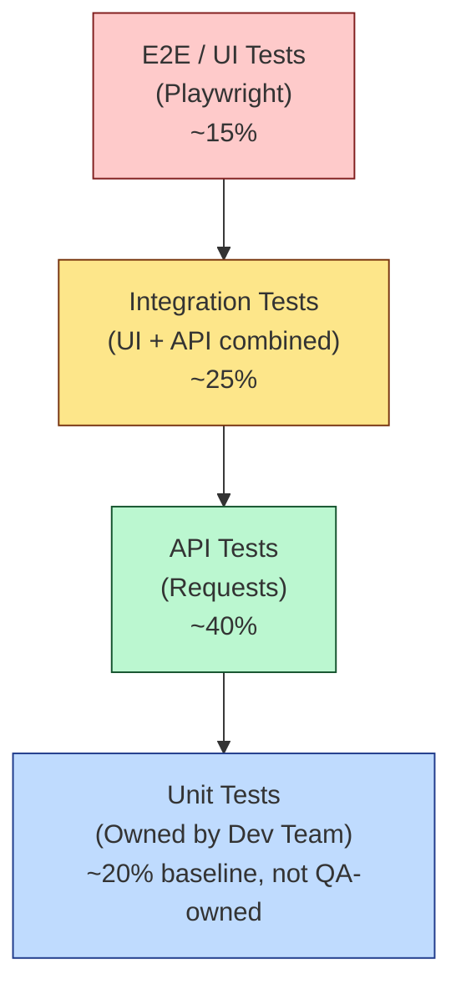
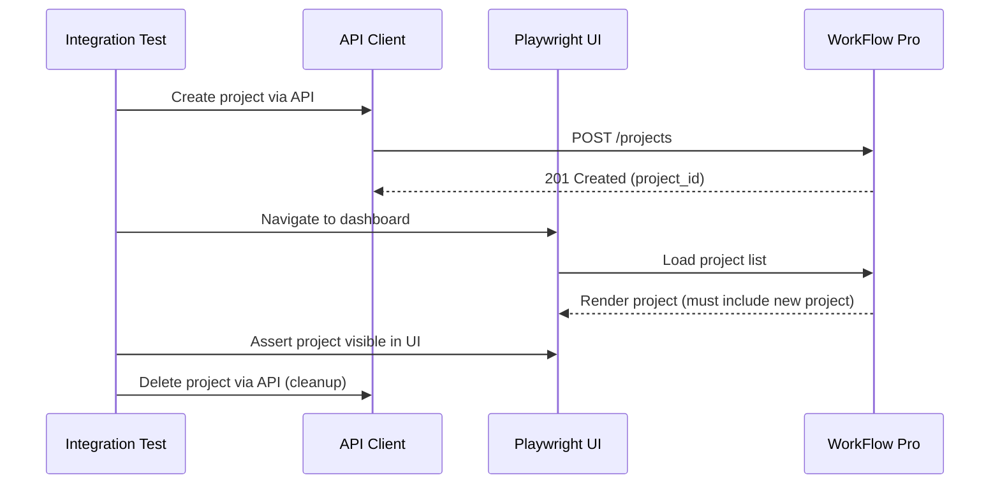
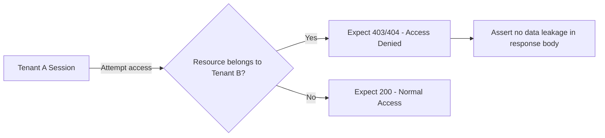
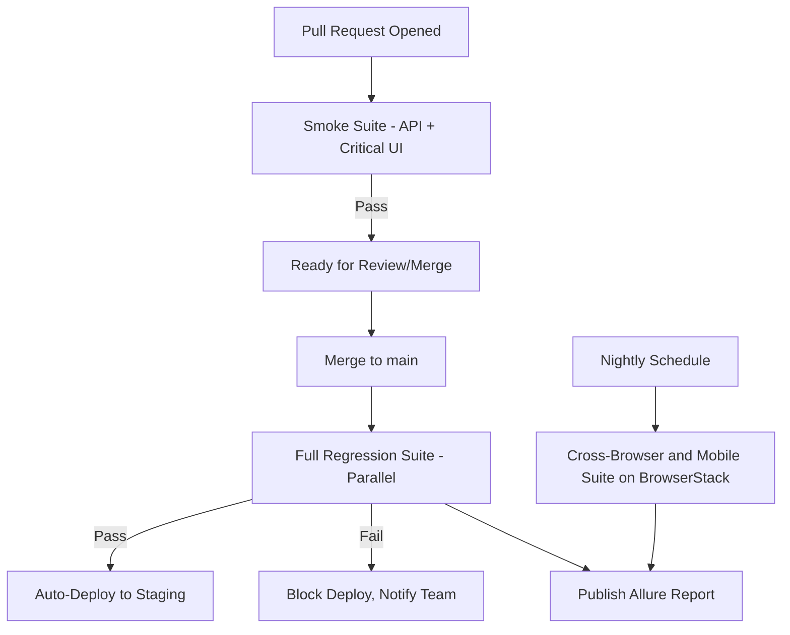
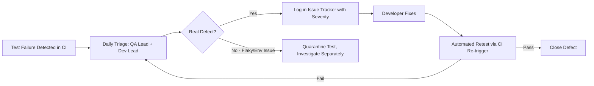

# Test Strategy – WorkFlow Pro QA Automation Framework

**Document Type:** QA Automation Strategy
**Owner:** QA Manager
**Version:** 1.0
**Status:** Approved

---

## 1. Testing Goals

WorkFlow Pro is a multi-tenant B2B SaaS project management platform, and its quality bar is defined by three non-negotiables: **tenant data isolation**, **functional correctness across web and mobile surfaces**, and **API contract stability**. The testing goals that drive this strategy are:

- Prevent tenant data leakage or cross-tenant access under any workflow.
- Ensure functional parity of core workflows (auth, projects, tasks, users) across browsers and devices.
- Catch regressions before they reach production through fast, automated feedback loops.
- Maintain confidence in API contracts as the backend evolves independently of the frontend.
- Reduce manual testing effort by automating high-value, repeatable scenarios, freeing manual QA for exploratory and usability testing.
- Provide engineering and product leadership with clear, data-backed visibility into release quality.

---

## 2. Automation Objectives

| Objective | Target Outcome |
|---|---|
| Shift-left testing | API and integration tests run on every pull request, before merge |
| Fast feedback | Smoke suite completes in under 10 minutes on every PR |
| High-value coverage | 80%+ of critical user journeys automated (login, project/task CRUD, tenant isolation) |
| Cross-platform confidence | Every regression cycle validated across 4 browsers and 3+ real devices via BrowserStack |
| Reduced manual regression load | 70% reduction in manual regression testing time within two quarters |
| Reliable reporting | 100% of CI runs produce an Allure report accessible to engineering and product stakeholders |
| Low flakiness | Automated suite flake rate maintained below 3% |

Automation is prioritized by **business risk and usage frequency**, not by ease of automation — tenant isolation and authentication are automated first regardless of complexity, because their failure has the highest blast radius.

---

## 3. Test Pyramid

The QA automation suite is weighted toward the API and integration layers, which are faster, more stable, and cheaper to maintain than UI tests. UI automation is reserved for scenarios that **must** be validated through the actual rendered interface — visual workflows, navigation, and cross-browser rendering — while business logic and data validation are pushed down to the API layer wherever possible.

| Layer | Ratio | Rationale |
|---|---|---|
| Unit (Dev-owned) | ~20% | Fast, isolated, owned by engineering, out of QA automation scope |
| API | ~40% | Fastest QA-owned layer; validates business logic and contracts directly |
| Integration | ~25% | Validates UI-to-API state consistency and cross-module workflows |
| UI/E2E | ~15% | Reserved for critical user journeys and visual/cross-browser validation |

---

## 4. Risk-Based Testing

Automation effort is allocated proportionally to risk, calculated as **Likelihood of Failure × Business Impact**.

| Feature Area | Likelihood | Impact | Risk Level | Automation Priority |
|---|---|---|---|---|
| Multi-tenant isolation | Medium | Critical | **Critical** | P0 |
| Authentication & session handling | Medium | Critical | **Critical** | P0 |
| Project/Task CRUD | High | High | **High** | P1 |
| Role-based access control (RBAC) | Medium | High | **High** | P1 |
| Dashboard/search/filters | Medium | Medium | **Medium** | P2 |
| Notifications | Low | Medium | **Medium** | P2 |
| Cross-browser rendering | Medium | Medium | **Medium** | P2 |
| Cosmetic/UI polish | Low | Low | **Low** | P3 (manual/exploratory) |

**P0** items are automated first and are release-blocking. **P1** items are automated within the same sprint cycle as their feature development. **P2/P3** items are automated opportunistically or covered by manual exploratory testing.

---

## 5. Smoke Strategy

- Smoke suite runs on **every pull request** via GitHub Actions and must complete in under 10 minutes.
- Covers the minimum viable path to confirm the build is testable: login, tenant context load, project creation, task creation, and core API health checks.
- Tagged with `@smoke` marker; failure blocks PR merge.
- Executes against a single browser (Chromium, headless) locally — no BrowserStack dependency — to keep feedback fast and infrastructure-light.

---

## 6. Regression Strategy

- Full regression suite (UI + API + Integration) runs automatically on every merge to `main` and before each release candidate.
- Executed in parallel via `pytest-xdist` to keep runtime manageable as the suite grows.
- Tagged with `@regression`; includes all P0/P1 risk-tier scenarios plus a rotating subset of P2 coverage.
- Cross-browser and mobile regression run **nightly** on BrowserStack rather than on every merge, balancing coverage depth against BrowserStack session cost and pipeline duration.
- Regression results feed a trend dashboard in Allure, allowing the team to track suite health (pass rate, flake rate, duration) over time.

---

## 7. API Strategy

- API tests are the **primary layer of business logic validation**, using `Requests` against the staging REST API.
- Coverage includes: functional (happy path), negative (invalid input, unauthorized access), contract/schema validation, and status-code/error-message correctness.
- API tests are used to **set up and tear down UI test data**, avoiding slow UI-driven data creation and keeping UI tests focused on UI behavior only.
- Authentication tokens are cached at session scope to avoid redundant login calls across the suite.
- Contract stability is protected via lightweight schema assertions (Pydantic/dataclasses) so backend response shape changes are caught immediately, independent of UI test runs.

---

## 8. UI Strategy

- UI automation uses **Playwright** with the **Page Object Model**, reserved for scenarios that require validating actual rendered behavior: navigation flows, form interactions, visual state changes, and multi-step user journeys.
- UI tests avoid re-validating logic already covered at the API layer — a UI test confirms *"the user can complete this journey through the interface,"* not *"the business rule is correct"* (that belongs to API tests).
- Each test uses a fresh, isolated `BrowserContext` to guarantee no session/cookie leakage between tests, which is especially critical for multi-tenant scenarios.
- Playwright's auto-waiting and web-first assertions are used exclusively — explicit `sleep()` calls are prohibited in the framework to minimize flakiness.

---

## 9. Integration Strategy

Integration tests validate that actions performed through one layer (UI or API) are correctly reflected in the other, catching synchronization bugs that neither layer alone would expose.

**Example flow validated by integration tests:**

- Integration tests are used heavily for **notification triggers**, **status transitions**, and **cross-module dependencies** (e.g., deleting a project cascades to its tasks).
- These tests intentionally mix API setup with UI verification (or vice versa) to validate true end-to-end data consistency, not just isolated layer correctness.

---

## 10. Mobile Strategy

| Aspect | Approach |
|---|---|
| Scope | Responsive web UI on mobile viewports; native/hybrid app smoke coverage |
| Tooling | Playwright (responsive emulation) + BrowserStack App Automate (real devices) |
| Coverage Depth | Smoke-level: login, dashboard load, core CRUD — not full regression parity with desktop |
| Devices | iPhone 14/15, Samsung Galaxy S23, Google Pixel 8, iPad Air |
| Frequency | Nightly, alongside cross-browser regression |

Mobile testing is intentionally scoped to smoke-level depth rather than full regression parity, reflecting WorkFlow Pro's primary usage pattern as a desktop-first B2B tool. Mobile coverage protects against critical breakage (unusable login, broken layouts) rather than exhaustively testing every workflow on every device.

---

## 11. Browser Compatibility Strategy

| Browser | Execution Frequency | Environment |
|---|---|---|
| Chrome (latest 2) | Every PR + nightly | Local (PR) + BrowserStack (nightly) |
| Firefox (latest 2) | Nightly | BrowserStack |
| Edge (latest) | Nightly | BrowserStack |
| Safari (latest) | Nightly | BrowserStack |

- Chrome is the **primary development and PR-gating browser** due to its dominant usage share among WorkFlow Pro's B2B customer base.
- Firefox, Edge, and Safari are validated nightly via BrowserStack's parallel session grid, catching rendering and compatibility regressions without slowing down PR feedback loops.
- Capability matrices are defined declaratively in configuration, allowing new browser/OS combinations to be added without code changes.

---

## 12. Multi-Tenant Validation Strategy

Multi-tenancy is the single highest-risk area of WorkFlow Pro and receives dedicated strategic focus beyond standard functional testing.

**Core validation principles:**
- Every test suite provisions **at least two isolated tenants** (Tenant A, Tenant B) with independent users, projects, and tasks.
- After every state-changing operation (create/update/delete), isolation tests explicitly assert that the *other* tenant's data remains completely unaffected and inaccessible.
- API-level isolation tests attempt cross-tenant access using Tenant A's token against Tenant B's resource IDs, asserting a `403`/`404` response — never a data leak.
- UI-level isolation tests verify tenant-switching does not leak cached state (e.g., stale project lists) from the previously active tenant.
- Isolation tests are tagged `@tenant_isolation` and run on **every regression cycle**, never skipped or deprioritized, regardless of pipeline time pressure.

---

## 13. Security Testing Strategy

Dedicated penetration testing is out of scope for the QA automation team (owned by a separate security function), but the automation suite includes **security-adjacent functional checks**:

| Check | Layer |
|---|---|
| Auth token expiry and rejection of expired/invalid tokens | API |
| Unauthorized cross-tenant resource access | API |
| RBAC enforcement (Viewer cannot perform Admin actions) | API + UI |
| Session invalidation on logout | UI + API |
| Input sanitization on form fields (XSS-pattern rejection) | UI |
| Rate-limiting / brute-force login protection | API |

These checks are integrated into the regular regression suite rather than run as a separate security pass, ensuring security regressions are caught with the same frequency as functional ones.

---

## 14. Performance Considerations

Full-scale load/performance testing is out of scope for this framework (owned by a dedicated performance engineering function using tools like k6 or Locust), but the QA automation suite incorporates lightweight performance awareness:

- API response time assertions (e.g., `< 800ms` for standard CRUD endpoints) are included as soft checks within functional API tests, flagged as warnings rather than hard failures to avoid environment-noise-driven flakiness.
- Playwright's navigation timing is captured for key pages (dashboard, project list) and logged to Allure for trend visibility, without gating the pipeline.
- Any performance regression signal from these soft checks is escalated to the performance engineering team for deeper investigation, rather than being treated as a functional QA defect.

---

## 15. CI/CD Strategy

- **PR Gate:** Smoke suite must pass before merge is allowed; enforced via GitHub Actions required status check.
- **Merge Gate:** Full regression suite runs on merge to `main`; failure blocks automatic deployment to staging.
- **Nightly:** Cross-browser and mobile matrix runs on a schedule, decoupled from the deploy pipeline to avoid slowing down developer velocity.
- All pipeline runs publish Allure reports as build artifacts and notify the team via Slack/email summary.

---

## 16. Test Data Strategy

| Data Type | Strategy |
|---|---|
| Dynamic data (projects, tasks, emails) | Generated per-test using UUID-suffixed values via a data generator utility, ensuring uniqueness under parallel execution |
| Tenant/user seed data | Provisioned via API calls at test setup, never via UI, for speed and reliability |
| Negative/edge-case data | Maintained as static, version-controlled fixture files |
| Cleanup | Handled in fixture teardown (`yield` pattern), with a scheduled CI job to purge orphaned test tenants weekly |

Test data is treated as **disposable and self-provisioning** — no test depends on pre-existing manually created data in the staging environment, ensuring the suite remains portable and repeatable across environments.

---

## 17. Environment Strategy

| Environment | Purpose | Automation Usage |
|---|---|---|
| Local/Dev | Developer sandbox | Manual + targeted smoke runs during development |
| QA | Dedicated automation execution environment | Primary target for CI smoke/regression runs |
| Staging | Pre-production, production-like | Full regression + cross-browser/mobile validation before release |
| Production | Live customer environment | Read-only smoke checks post-deployment only (no data-mutating tests) |

Environment selection is controlled via a single configuration switch (`ENV=qa|staging|prod`), keeping the same test code portable across environments without duplication.

---

## 18. Reporting Strategy

- **pytest-html** provides fast, single-file pass/fail summaries for local development and quick PR checks.
- **Allure Reports** serve as the primary stakeholder-facing report, published after every CI run with feature/story tagging, severity classification, screenshots, and trace attachments on failure.
- **BrowserStack Dashboard** supplements Allure for cross-browser/device runs with session recordings and device logs.
- A weekly QA health summary (pass rate trend, flake rate, defect count by severity) is compiled from Allure history and shared with engineering leadership.

---

## 19. Defect Workflow

- Failures are triaged daily to distinguish genuine defects from flaky or environment-related failures.
- Flaky tests are **quarantined** (excluded from the blocking suite, tracked separately) rather than left to silently erode trust in the pipeline.
- Defects are logged with severity, reproduction steps, and Allure attachments (screenshots, traces), and closed only after an automated retest confirms the fix in the target environment.

---

## 20. Continuous Improvement Plan

- **Flake rate monitoring:** Weekly review of Allure trend data to identify and remediate unstable tests, targeting a sustained flake rate below 3%.
- **Coverage audits:** Quarterly review of risk-tier mapping (Section 4) against actual production incidents to recalibrate automation priorities.
- **Framework retrospectives:** Monthly review of framework pain points (slow tests, brittle locators) feeding into `utils/` and `pages/` refactoring backlogs.
- **Tooling evaluation:** Ongoing evaluation of complementary tools — visual regression, contract testing, accessibility scanning — for phased integration into the pipeline.
- **Knowledge sharing:** Regular internal sessions to onboard new engineers onto the framework and gather feedback on developer experience (test-writing friction, fixture clarity).
- **Metric-driven roadmap:** Automation investment is continuously reprioritized based on defect escape rate by feature area, ensuring the strategy evolves with the product rather than remaining static.

---

*This Test Strategy is a living document, reviewed quarterly and updated in response to product changes, incident learnings, and framework maturity.*
